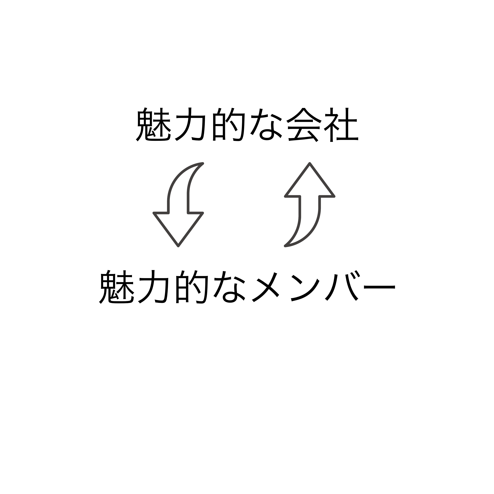

# この合宿で意識合わせしたいこと

---

## 1. **いまのデータインサイトの魅力**は何か
## 2. **どんな魅力のある会社**にしていきたいか

---

# 「会社の魅力」ってなにもの？？

---

# 優秀なエンジニアをフルタイムで採用したい！
## →なんて誘う？

---

## 優秀な人を連れてくるときに誘う誘い文句

- 急成長している体験ができる
- リーダーが魅力
- 社会的意義の高い事業
- 技術的に最先端
- テーマの先見性
- プロダクトが魅力
- 人が優秀もしくは面白い
- 稼げそう(給料・株)
- ...

---

# 急成長している体験ができる

---

# [キャディ](https://corp.caddi.jp/)

- 2017/11創業
- 現在(2021/8時点)
    - シリーズB
    - 従業員: 160人
    - 累計資金調達額: 99.3億円

---

# リーダーが魅力

---

# [Now Do株式会社](https://nowdo.jp/company/)

- 本田圭佑の立ち上げた会社
- **社長が魅力的であれば勝手に人は集まる**

---

# 社会的意義の高い事業

---

# [WOTA](https://wota.co.jp/)

- 水道のない場所での水利用を実現できる技術を開発
- 「利用できる水」の開発は社会問題だけでなく国力などにも直接影響
    - 参考: [「水戦争」](https://diamond.jp/articles/-/264883?page=2)

---

# 技術的に最先端

---

# [H2L](http://h2l.jp/)

- 身体感覚の通信・共有
    - [BodySharing(動画)](https://youtu.be/1uuYgSPtCuY)
    - [電気刺激による人体制御(動画)](https://youtu.be/wVRV89ttOCk)

---

# テーマの先見性

---

# [estie](https://www.estie.jp/corp/)

- オフィス不動産の統合データベースをつくる
    - オフィス移転が簡潔になる
    - 合理的に意思決定できるようになる

---

## なぜ勝てるのか

- オフィス不動産投資のための材料集めが日本だと困難
    - 統合データベースがない
    - 価格が不透明
- なぜか日本だとスタートアップほぼない
    - estie創業当初は[RESTER](https://www.restar-inc.com/)とestieのみ
    - 大手デベロッパー出身者じゃないと無理
        - ただ、やめない+IT弱い

---

## テーマの先見性を魅力にすることの難しさ

- 「勝馬」であれば投資家ウケはいい
- メンバーは勝馬に乗るだけじゃない
    - 実際に手を動かすので**そんなモチベーションじゃ動かない**
    - ※メンバー: 取締役+社員+インターン

---

# ・プロダクトが魅力
# ・人が優秀もしくは面白い
# ・稼げそう(給料・株)

---

# 「人、プロダクト、金が魅力」は結果論的

- **魅力的な会社だから魅力的な人が集まる**

- **人が魅力的だから魅力的な会社になる**

